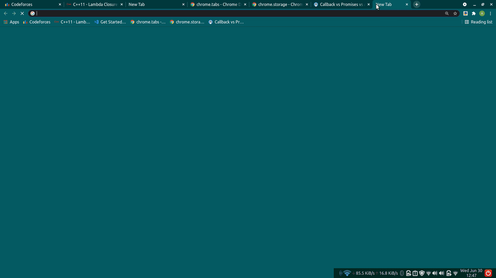

# TabStacker
A Google Chrome Browser extension to automate Tab Management.
Google Chrome is currently the best web browser but users keep searching for alternatives due to Chrome's heavy RAM usage. The number of opened Tabs dictates the RAM usage of the browser.
Users don't want to close the opened tabs and at same time want efficient performance from browser. But what if Chrome automatically removes earlier inactive tabs automatically, save it and then restore it when user closes newly created tabs?
This extension tries to do that job. The extention maintains fixed number of opened tabs per window. This restricts Browser from overusing device RAM.
You can set a limit for maximum opened tabs per window (default 10).

The extension only removes the oldest inactive tabs for newly created tabs. The extension ignores pinned tabs and active tabs. If the removed tab was empty, it won't be restored for obvious reason.
Once user removes the newly created unnecessary tabs and if total number of opened tabs per window falls under defined limit, saved tabs are automatically restored.
The removed tabs can be accessed through extension pop-up. Currently there's no support for opening saved tabs manually through pop-up but will be definitely added in future.

Chrome Browser has an inbuilt feature to kill unnecessary tabs but it waits till the device throttles. Also if the number of opened tabs are more (example 20,30,etc) it would be really difficult for user to access each tab manually. This extension manages to solved that problem too by maintaining limited number of opened tabs and close and save remaining in local memory accessible through extension pop-up.
